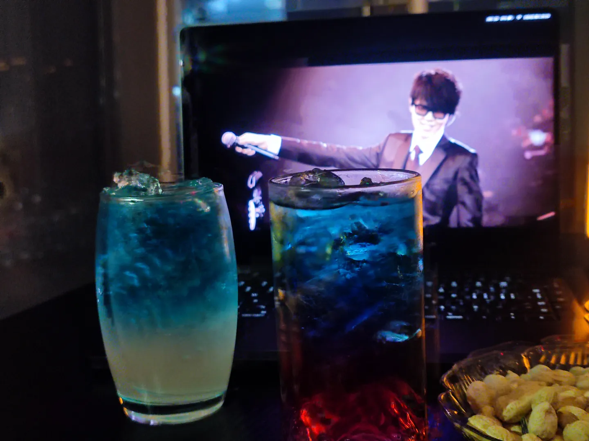

生日快乐

是的，我刚刚过了一个生日。

说来也巧，我身边的朋友有 5 号生日，有 6 号生日，也有 8 号生日的，每年我们都可以连续庆祝四个人的生日。

## 生日礼物

### 佳能 CP1300

摄影部的朋友送了我一台佳能的 CP1300 照片打印机，可能是因为我之前一直和他念叨我想买一台 CP1500 吧。虽然 1300 差了一些，但还是十分欣喜的接纳了。

### AirPods Pro USB-C

AirPods Pro 是我送给我自己的生日礼物。我起初计划在淘宝购买一个二手的资源机 AirPods Pro 2，但经过调研，尽管有的商家发给你的 AirPods Pro 依旧包含可用的保修计划甚至 AppleCare+ ，他仍有可能是盗版机器，即套用了正版 AirPods Pro 的序列号。最后在反复取舍后我还是取消了二手的订单，多加了一笔钱购买百亿补贴的全新机器。

由于未知原因，我的淘宝账户无法购买百亿补贴商品，于是我请社长代为购买。在漫长的等待（两天）后，他终于在许诺的发货时间（23:50）前 1 小时发货。

收到手的耳机生产于 2025 年，中国制造，也是顺利下车。

## 宿醉

<!--
事情来到 3 月 8 日，终于和**她**有机会出门了。

终于终于终于，两个互相经常有事放鸽子的凑出了共同的时间出门玩。

我们先去了地下广场的酸菜鱼吃了晚餐（购物中心楼上人真的多）。之后我们便计划去一家名为**烽 homebar** 的清吧小酌片刻。

等到 20:00，在经历了漫长的找电梯后，我们终于来到了那家酒吧。位于高处的小清吧中风景很好，背景音乐放着应景的歌儿。

> 再见呆同

我和**她**初中就认识了，是前后桌。我一直以为我留有**她**的联系方式，但去年的同学聚会上我才发现我尽没有**她**的好友。

自打我结束了上一段感情之后，我便总感觉空空落落的，我尝试和别人也形成一种保持分享的关系，但终究难以实现，直到这几个月和**她**聊到一块。

事情开始于去年年底的新年寄信，**她**突然来问我的班级。寄来的信有些老生常谈，我却从那开始习惯地找**她**聊天。

之后的寒假里，我们本来约定好一同去之前同学聚会返程时找到的酒吧，**她**却因为身体不适放了鸽子（抛开**她**生理期第二天和朋友逛街临时起意去喝了一杯不谈）。

虽然之后也反反复复地约定了时间，但总因我或者**她**种种的事情耽搁了。终于在**国际劳动妇女节**这天找到了时间决定出门。

这段时间的聊天，我感觉我好似对**她**进入了一种超出*普通朋友*的感觉。我们席地而坐。**她**在那用我的平板画着简单的多格漫画。我时不时尝试逗逗**她**，**她**有时回击，有时也无可奈何。

席间，我尝试着说出那句话：“我觉得我有些喜欢你。”可当我邀请我兄弟（即上文送我 CP1300 的朋友）直至他到来我都没找到一个两人安静下来的机会问出这句话。

那天晚上我俩都喝了 2 杯多的特调，我们是让老板根据**她**的想法给我们随机调制。晚上 11 时许，在酒吧组织的游戏中，我喝完了第三杯酒，本觉得无事。兄弟的家中打来电话，催促着他赶紧回家。由于我家顺路，再加时候不早了，我们三个便收拾东西准备返程。

当我踏出酒吧的第一刻，我便感觉有些许不稳，这种感觉在下电梯开始愈加强烈。当我走入家门时，我已经感觉眼前手机屏幕有些模糊。

本来感觉在线上表达自己的感情有些许不妥与害羞，但或许是酒后兴致什么的，我当晚在 QQ 上和**她**说了一些话。之前在酒吧时，我听到了她和一位我也相识的学妹的聊天，猜测她可能没有在高考前谈恋爱的打算。我也只是和她说了我对她的感觉，她过了一段时间，也没有回复什么特别惊讶的话，也只是回答说高考之后再说。

次日醒后依旧保持着问安的习惯，她也回复了，一切看似寻常。

高考之后的我们会怎么样呢？

我好像真的有些喜欢你。

-->

祝我生日快乐。
